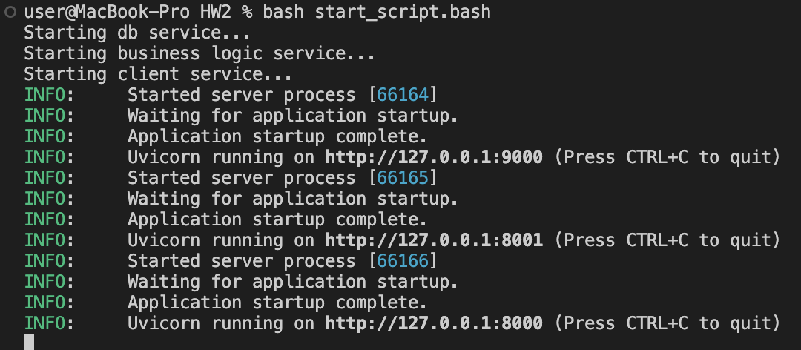
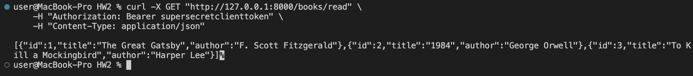
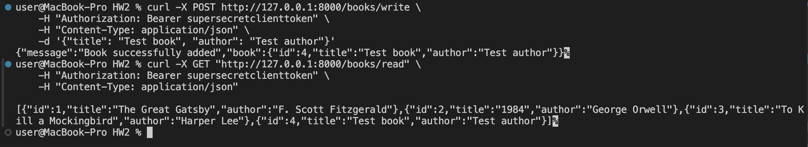
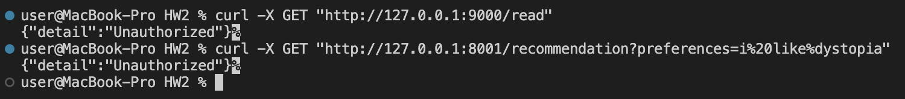

# Development of a basic REST-based application with Token authentication

Here you can find three services: client service - for interaction with external users, db service and business logic service - for internal intercation with another services.
## Run app
To start app, firstly, you should download dependencies. Run this command in terminal ```pip install uvicorn fastapi pydantic```. Then run in the terminal this command ```bash start_script.sh``` (you should be in the same dir where project is located). This script will start all three services.

Client service is available on **http://127.0.0.1:8000**.

## How token-based authentication works
Client service also uses token-based authentication. How it works? - when you send a request to client service you need provide authorization header with specific token, then service checks whether provided token matches with some backend defined token, if so, you will have access to endpoints, if not, you will not be able to use endpoints (you will receive error *"Unauthorized"*). The same logic used to implement isolation of db service and business logic service. To use these two services, you also need specific token, which is only known to the client service.

## Request flow for each endpoint
1. **/books/read**: Client -> Client Service -> DB Service -> Client Service -> Client
2. **/books/write**: Client -> Client Service -> DB Service -> Client Service -> Client
3. **/recommendation**: Client -> Client Service -> Business Logic Service -> DB Service -> Business Logic Service -> Client Service -> Client

## Example of usage (using ```curl```)
1. Start app

2. Get all books

3. Add new book and check whether it is added

4. Get recommendation for preferences "I like dystopia"

5. Check whether db service and business logic service isolated


## Nota bene
To interact with client service use this token: **supersecretclienttoken**

For internal communication between services use this token: **tokenforinternalusage**

To interact with LLM create API key in https://openrouter.ai/