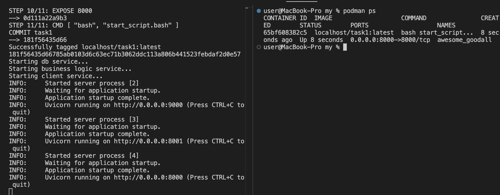
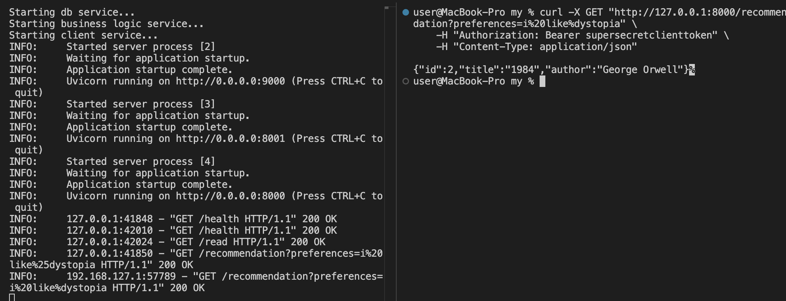
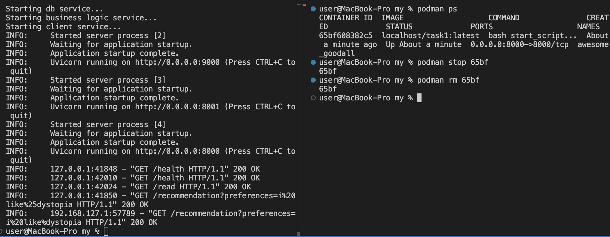
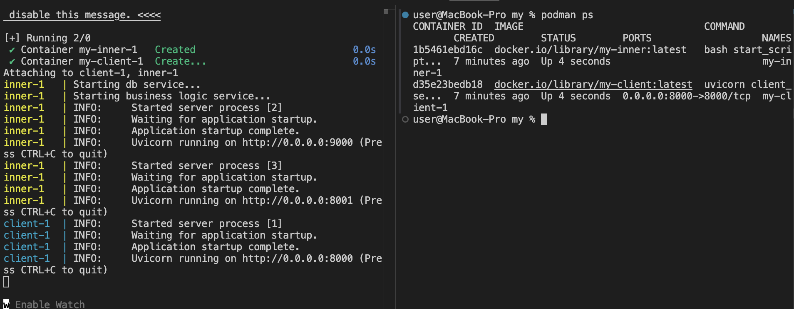
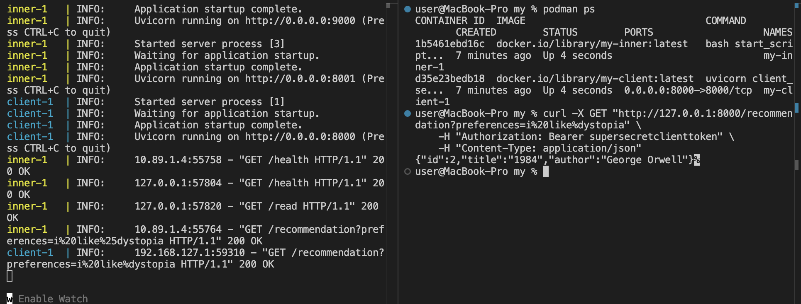
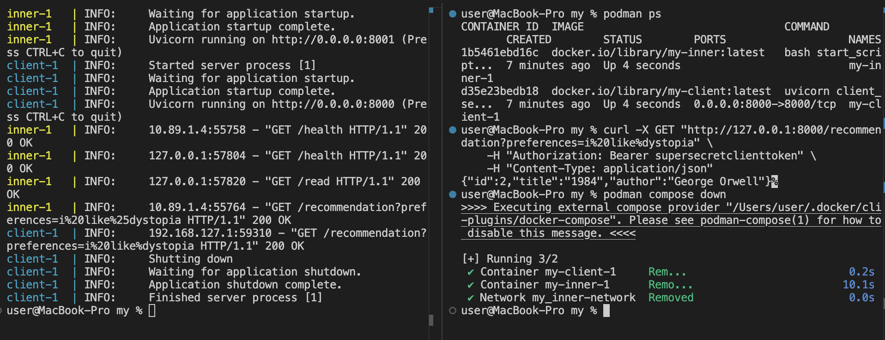

## Description

In this assignment, I packed HW2 inside one docker container (task 1) and inside 2 docker containers (task 2, additionally added internal network)

## Results
### Task 1
1) Run ```bash task1.sh``` to build and start docker container

2) Make requests to get recommandation depends on provided query (query from HW2) and check logs of container

3) Stop container and clean env

### Task 2
1) Run ```bash task2.sh``` to build and start docker compose file

2) Make request and check logs of containers

3) Stop containers and clean env

